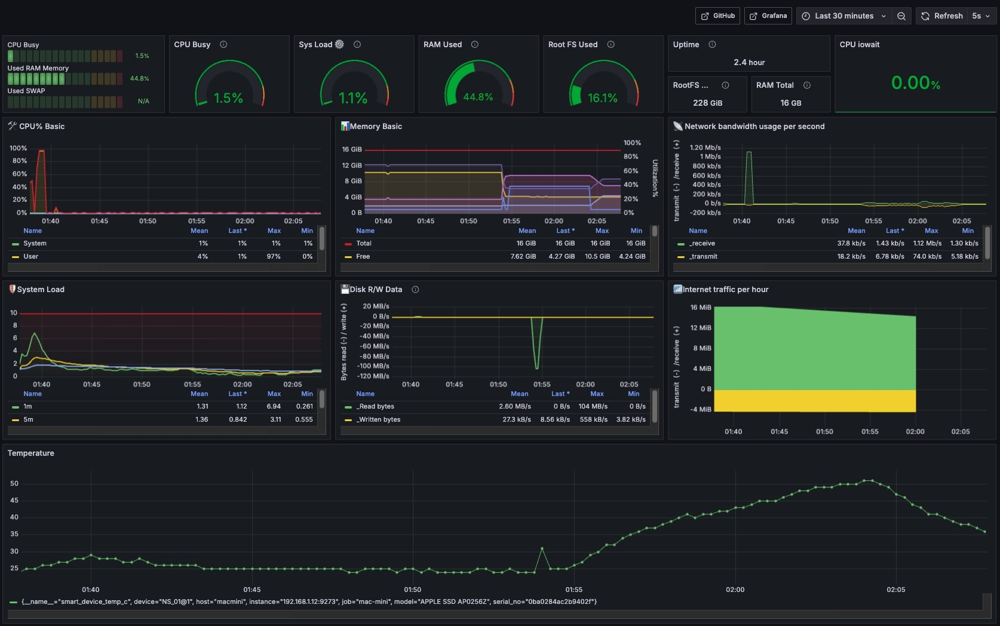

# Telegraf MacOS Monitoring



A comprehensive guide for setting up Telegraf on Mac Mini to collect system metrics including CPU temperature, power consumption, and system performance metrics. This setup enables forwarding of collected metrics to Prometheus for monitoring and visualization.

## Features

- CPU metrics collection (temperature, power, frequency)
- System performance monitoring
- Disk I/O tracking
- Network monitoring
- Smart disk monitoring
- Automatic startup configuration
- Prometheus integration

## Prerequisites

- Mac Mini/Macbook running macOS
- Administrative access
- [Homebrew](https://brew.sh/) package manager
- Prometheus server (optional, for metrics collection)

## Quick Start

1. Install required packages:
```bash
# Install Homebrew if not already installed
/bin/bash -c "$(curl -fsSL https://raw.githubusercontent.com/Homebrew/install/HEAD/install.sh)"

# Install Telegraf and smartmontools
brew install telegraf smartmontools
```

2. Create Telegraf user and setup permissions:
```bash
sudo dscl . -create /Users/telegraf
sudo dscl . -create /Users/telegraf UserShell /bin/bash
sudo dscl . -create /Users/telegraf RealName "Telegraf Agent"
sudo dscl . -create /Users/telegraf UniqueID 1001
sudo dscl . -create /Users/telegraf PrimaryGroupID 20
sudo dscl . -create /Users/telegraf NFSHomeDirectory /Users/telegraf
sudo mkdir -p /Users/telegraf
sudo chown -R telegraf:staff /Users/telegraf
```

3. Set up configuration:
```bash
# Backup original configuration
sudo cp /opt/homebrew/etc/telegraf.conf /opt/homebrew/etc/telegraf.conf.backup

# Create new configuration
sudo nano /opt/homebrew/etc/telegraf.conf
```

## Configuration

### Basic Telegraf Configuration

Copy and paste the following configuration into `/opt/homebrew/etc/telegraf.conf`:

```toml
[agent]
  interval = "10s"
  round_interval = true
  metric_batch_size = 1000
  collection_jitter = "0s"
  flush_interval = "10s"
  flush_jitter = "0s"
  hostname = "macmini"
  omit_hostname = false

# BASIC MONITORING
[[inputs.cpu]]
  percpu = true
  totalcpu = true
  collect_cpu_time = false
  report_active = false

[[inputs.mem]]
[[inputs.swap]]
[[inputs.system]]

# CPU POWER AND THERMAL MONITORING
[[inputs.exec]]
  commands = [
    "sh -c 'sudo powermetrics -s thermal,cpu_power -i1 -n1 | grep -E \"Current pressure level:|CPU Power:\" | awk -F\": \" \"{print $2}\" | tr \"\\n\" \" \" | awk \"{print \\\"cpu_power=\\\"$1\\\" pressure_level=\\\"$2}\"'"
  ]
  data_format = "grok"
  grok_patterns = [
    "cpu_power=%{NUMBER:cpu_power:float}%{WORD}%{SPACE}pressure_level=%{WORD:pressure_level:tag}"  
  ]
  interval = "10s"

# CPU FREQUENCY
[[inputs.exec]]
  commands = [
    "sh -c 'sudo powermetrics -s cpu_power -i1 -n1'"
  ]
  data_format = "grok"
  grok_patterns = [
    "CPU %{NUMBER:cpu:tag} frequency: %{NUMBER:frequency:float} MHz"
  ]
  interval = "10s"

# DISK MONITORING
[[inputs.disk]]
  ignore_fs = ["tmpfs", "devtmpfs", "devfs", "overlay", "aufs", "squashfs"]
  mount_points = ["/"]

[[inputs.diskio]]
  devices = ["disk0"]
  skip_serial_number = false

[[inputs.smart]]
  path_smartctl = "/opt/homebrew/bin/smartctl"
  use_sudo = true

# NETWORK MONITORING
[[inputs.net]]
  interfaces = ["en0", "en1"]

[[inputs.ping]]
  urls = ["8.8.8.8"]
  count = 4
  ping_interval = 1.0

# OUTPUT CONFIGURATION
[[outputs.prometheus_client]]
  listen = ":9273"
  metric_version = 2
  metric_batch_size = 1000
  metric_buffer_limit = 10000
  expiration_interval = "60s"
```

### System Integration

1. Configure powermetrics permission:
```bash
sudo visudo
# Add this line:
telegraf ALL=(ALL) NOPASSWD: /usr/bin/powermetrics
```

2. Create and configure launch daemon:
```bash
sudo nano /Library/LaunchDaemons/com.telegraf.plist
```

Add the following content:
```xml
<?xml version="1.0" encoding="UTF-8"?>
<!DOCTYPE plist PUBLIC "-//Apple//DTD PLIST 1.0//EN" "http://www.apple.com/DTDs/PropertyList-1.0.dtd">
<plist version="1.0">
  <dict>
    <key>Label</key>
    <string>com.telegraf</string>
    <key>ProgramArguments</key>
    <array>
      <string>/opt/homebrew/bin/telegraf</string>
      <string>--config</string>
      <string>/opt/homebrew/etc/telegraf.conf</string>
    </array>
    <key>RunAtLoad</key>
    <true/>
    <key>KeepAlive</key>
    <true/>
    <key>StandardErrorPath</key>
    <string>/var/log/telegraf.log</string>
    <key>StandardOutPath</key>
    <string>/var/log/telegraf.log</string>
  </dict>
</plist>
```

3. Set permissions and start service:
```bash
sudo chown root:wheel /Library/LaunchDaemons/com.telegraf.plist
sudo chmod 644 /Library/LaunchDaemons/com.telegraf.plist
sudo launchctl load /Library/LaunchDaemons/com.telegraf.plist
```

## Verification

Check if everything is working:

```bash
# Check service status
sudo launchctl list | grep telegraf

# Verify metrics
curl localhost:9273/metrics | grep -E "pressure|power"

# Check logs
tail -f /var/log/telegraf.log
```

## Prometheus Integration

Add to your `prometheus.yml`:

```yaml
scrape_configs:
  - job_name: 'mac-mini'
    static_configs:
      - targets: ['localhost:9273']  # Replace with Mac Mini IP if needed
```

## Available Metrics

### System Metrics
- CPU Usage:
  - System: `cpu_usage_system{cpu="cpu-total",host="macmini"}`
  - User: `cpu_usage_user{cpu="cpu-total",host="macmini"}`
  - Idle: `cpu_usage_idle{cpu="cpu-total",host="macmini"}`
- Memory:
  - Used: `mem_used_percent{host="macmini"}`
  - Available: `mem_available_percent{host="macmini"}`
- Disk:
  - Used: `disk_used_percent{host="macmini"}`
  - Temperature: `smart_device_temp_c{host="macmini"}`
- CPU Frequency: `exec_frequency{cpu="N",host="macmini"}` (MHz)
- System Load: `system_load1{host="macmini"}`

## Troubleshooting

If you encounter issues:

1. Check logs:
```bash
tail -f /var/log/telegraf.log
```

2. Verify telegraf user:
```bash
id telegraf
```

3. Test powermetrics:
```bash
sudo -u telegraf sudo powermetrics -s thermal,cpu_power -i1 -n1
```

## 👨‍💻 Author

dongtran ✨